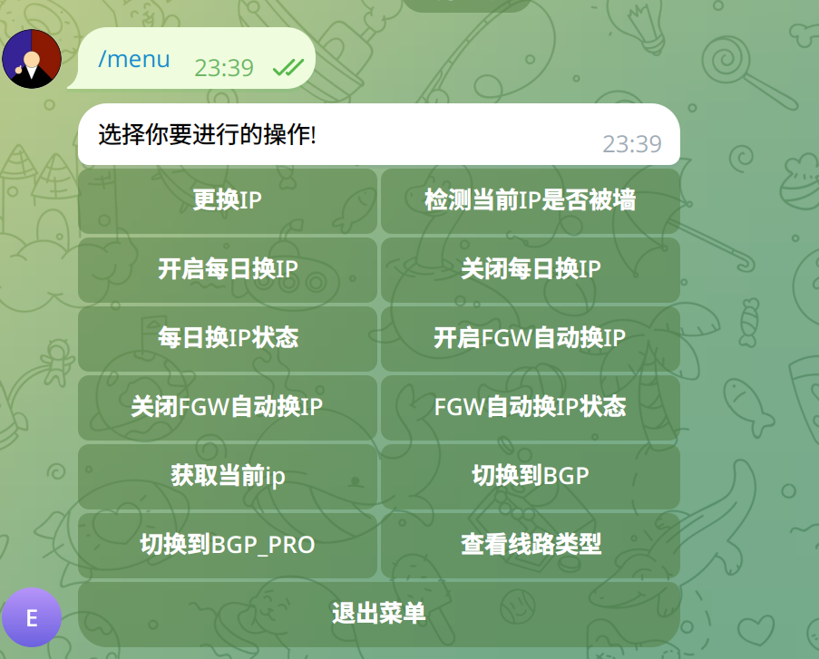

## IAAS Sponsor

<div style="text-align: center;">
    <a href="https://yxvm.com/">
        
    </a>
</div>


我们非常感谢 [Yxvm](https://yxvm.com/) 提供了支持本项目所需的网络基础设施。


# 在国内端部署 GFW检测程序

## `docker`部署

```shell
sudo docker run -d -p 5000:5000  --restart unless-stopped --name checkip betteryjs/checkip
```


## 在 https://t.me/BotFather 创建通知机器人 

## 通过 https://t.me/getmyid_bot 获取私聊chat_id 或者 通过 https://t.me/get_id_bot 获取群组chat_id

## 克隆项目

```shell
git clone git@github.com:betteryjs/EcsAutoChangeIPShare.git

cd EcsAutoChangeIPShare
```

## 复制` config.json.exp` 到 `config.json` 修改其中字段


```shell
{
  "AccessKeyId": "xxxxx", # 填入阿里云AccessKeyId
  "AccessKeySecret": "xxxxx",  # 填入阿里云AccessKeySecret
  "region_id":"cn-hongkong", # 填入机器的地域
  "name": "aliyun-HK-ECS",  # 填入通知名字
  "email": "xxxxxx@gmail.com", # 填入CF的个人邮箱
  "api_key": "xxxxxxxxxxxx", # 填入CF的Global API Key	
  "domain": "example.xyz", # 填入ddns的主域名
  "TGBotAPI": "xxxxxxxxxxx", # 填入Botfather上面获取的TG bot token
  "chartId": "xxxxxxxxxx", # 填入上面获取的私聊chat_id或者群组chat_id
  "ddnsUrl": "ddns.example.xyz", # 填入要ddns的域名 先要吧Hinet的ip解析到要ddns的域名上
  "checkGFWUrl": "http://填入在国内端部署的GFW检测程序的IP:5000/checkip/", # 例如 http://1.1.1.1:5000/checkip/
  "changeIPCrons": "0 3 * * *", #每日换IP的crontab 时间 默认每天凌晨3点
  "checkGfwCron": "*/10 * * * *", # 被墙检测默认10分钟1次
  "Linetype": "BGP",        # IP的类型 BGP 或者 BGP_PRO  BGP（默认值）：BGP（多线）线路。目前全部地域都支持 BGP（多线）线路 EIP。BGP_PRO：BGP（多线）_精品线路。目前仅中国香港、新加坡、日本（东京）、马来西亚（吉隆坡）、菲律宾（马尼拉）、印度尼西亚（雅加达）和泰国（曼谷）地域支持 BGP（多线）_精品线路 EIP。
  "InstanceId": "xxxxxx",    # 要开启自动换IP的实例ID
  "authorized_users": ["AS99294837"], # 机器人授权给那些用户
  "checkgfwport": "10241"             # TCP检测的端口号 可以在这个端口建立一个节点 这样TCP端口就是打开的
}

```


## 在机子上安装Python环境

```
./initvenv.sh
```


## 配置开启Install
```
./install.sh

```

### 在切换线路后要手动点击更换IP



